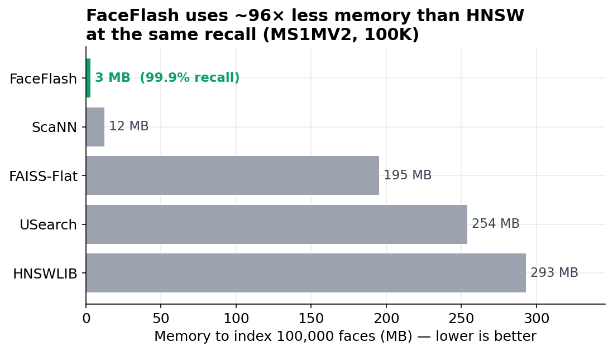
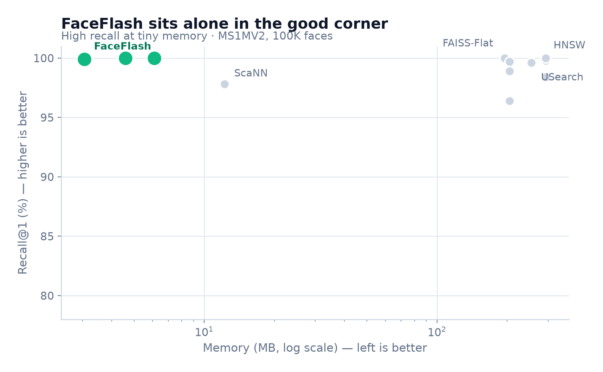
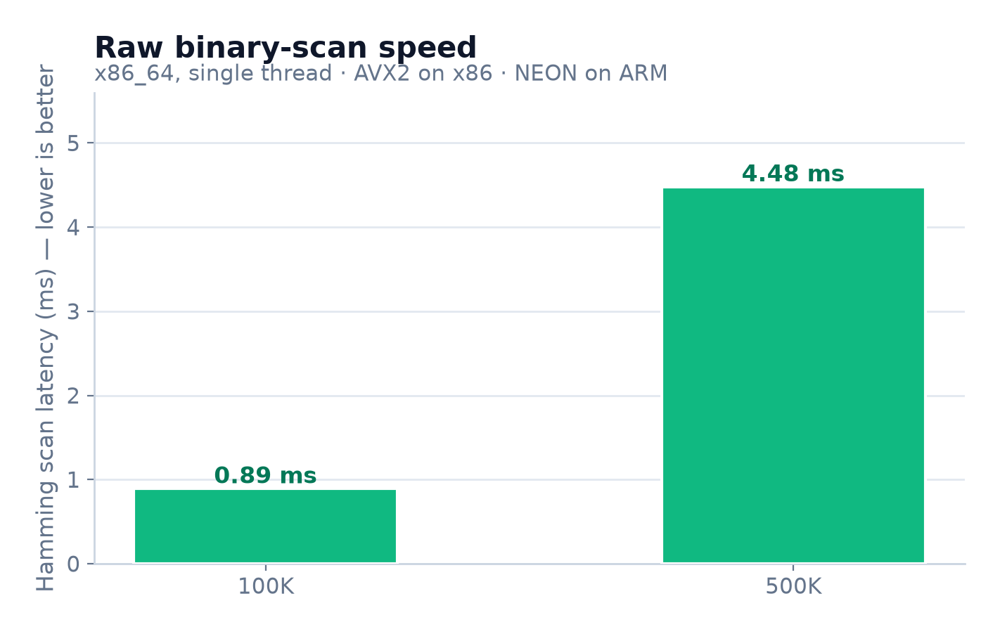
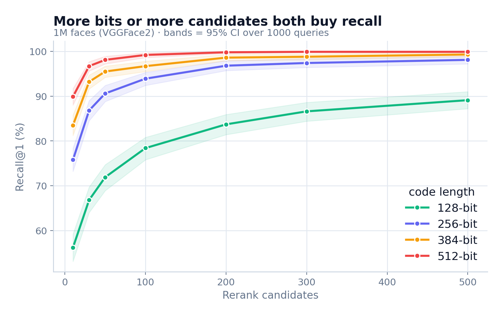

# FaceFlash

<!-- GitHub repo settings: add topics: face-recognition, vector-search, binary-hashing, edge-ai, memory-efficient, arcface, rust -->

[](LICENSE)
[](https://python.org)
[](rust/)
[](https://github.com/raghavenderreddygrudhanti/faceflash/actions)

**Face search that fits in a megabyte.**

Search 45,000 distinct people in 2.8 MB. Search 500,000 faces in 30 MB.
Same accuracy as exact brute-force search, 48-96x less memory. Runs on CPU.

```
pip install "faceflash[cpu] @ git+https://github.com/raghavenderreddygrudhanti/faceflash.git"
```

## At a Glance

|  | FaceFlash | HNSWLIB (best competitor) |
|--|-----------|--------------------------|
| Find the right person (rank-1) | **95.8%** | 95.8% (exact ceiling) |
| Memory for 100K faces | **3 MB** | 293 MB |
| Memory for 500K faces | **30 MB** | 1,465 MB |
| Recall@1 at 100K | **99.9%** | 99.5% |
| Recall@1 at 500K | **99.9%** | 99.5% |

Tested on MS1MV2 (45,832 distinct identities) and VGGFace2 (500K images).
All methods single-threaded, same hardware, same data.

> **Memory = binary index only.** Float vectors for reranking are mmap'd from disk after `save()`/`load()` — only ~100 candidate rows are paged per query. See [Limitations](#limitations) for details.




## Quick Start

```python
from faceflash import FaceFlash

ff = FaceFlash()  # first run downloads ArcFace model (~166MB)

# Register faces (best results with pre-aligned 112×112 crops)
ff.register("Alice", "alice.jpg")
ff.register("Bob", "bob.jpg")

# Search
result = ff.search("query.jpg")
print(result)
# {"matches": [{"name": "Alice", "confidence": 0.92}], "search_time_ms": 0.5}

# Verify two faces
ff.verify("photo1.jpg", "photo2.jpg")
# {"match": True, "confidence": 0.87}

# Bulk register + save
ff.register_folder("employees/")  # folder/person_name/photo.jpg
ff.save("my_index/")
```

> **Note:** Installing from source builds the Rust POPCNT backend (50× faster search) into the package automatically — it just needs a Rust toolchain present (prebuilt PyPI wheels need nothing). If the backend is unavailable, search transparently falls back to NumPy. For best accuracy, use pre-aligned 112×112 face images. See [Limitations](#limitations).

## How It Works

Each face becomes a tiny binary fingerprint (64 bytes), searched with hardware
POPCNT, then the top few candidates are verified with exact cosine similarity.
You get exact-quality accuracy at a fraction of the memory.

```
Image → Detect Face → ArcFace Embedding (512-dim) → PCA+ITQ Binary Code (64 bytes)
                                                              ↓
Query → Same pipeline → Hamming Scan (Rust POPCNT) → Top-K Cosine Rerank → Match
```

## vs the Competition (100K faces, single-threaded)

|  | FaceFlash | FAISS-Flat | FAISS-IVF | HNSWLIB | USearch | ScaNN |
|--|-----------|-----------|-----------|---------|---------|-------|
| **Recall@1** | 99.9% | 100% | 99.8% | 99.5% | 97.4% | 81.5% |
| **Latency** | 0.53ms | 4.92ms | 1.20ms | 0.24ms | 0.10ms | 0.10ms |
| **Memory** | **3 MB** | 195 MB | 205 MB | 293 MB | 254 MB | 12 MB |
| **Training** | None | None | Required | Required | Required | Required |
| **GPU needed** | No | No | No | No | No | No |

**FaceFlash wins:** memory (48-96× less than graph indexes), no training step, highest recall among memory-efficient options.

**FaceFlash loses:** latency (HNSW/USearch/ScaNN are 2-6× faster at the cost of 40-50× more RAM).

**Bottom line:** if you have unlimited RAM, use HNSW. If memory is the constraint — edge, mobile, IoT, cheap hardware — FaceFlash is the only option that holds 99%+ recall.

## Detailed Benchmarks

All benchmarks: single-threaded, `time.perf_counter()` per query, ground truth = exact brute-force cosine argmax.

### 1:N Identification — 45,832 Distinct People (MS1MV2)

The hardest test: one photo per person in the gallery, find them using a *different* photo. Gallery of 45,832 identities, 5,000 probes.


| Method | Rank-1 Accuracy | Memory |
|--------|----------------|--------|
| FAISS-Flat (exact ceiling) | 95.8% | 93.9 MB |
| **FaceFlash (512b/100c)** | **95.8%** | **2.80 MB** |
| FaceFlash (256b/100c) | 95.7% | 1.40 MB |

FaceFlash ties exact search using **34× less memory** — the binary compression is free, no accuracy loss. Tripling the gallery from 13.7K to 45.8K identities did not move rank-1.

### vs All ANN Methods — 100K Faces (MS1MV2, 8,540 identities)



| Method | Recall@1 | Latency | Memory | Type |
|--------|----------|---------|--------|------|
| FAISS-Flat (exact) | 100% | 4.92ms | 195 MB | brute force |
| HNSWLIB (ef=128) | 99.5% | 0.24ms | 293 MB | graph |
| HNSWLIB (ef=64) | 99.2% | 0.13ms | 293 MB | graph |
| USearch | 97.4% | 0.10ms | 254 MB | graph |
| ScaNN | 81.5% | 0.10ms | 12 MB | quantized |
| **FaceFlash (512b/100c)** | **99.9%** | 0.95ms | **6.1 MB** | binary hash |
| **FaceFlash (256b/300c)** | **99.7%** | 0.55ms | **3.0 MB** | binary hash |

FaceFlash: **96x less memory** than HNSW at equal recall. HNSW is ~4x faster — that's the tradeoff.
ScaNN (the other memory-efficient option) drops to 82% recall. FaceFlash holds 99.9%.

### vs All ANN Methods — 500K Faces (MS1MV2, 42,502 identities)

| Method | Recall@1 | Latency | Memory |
|--------|----------|---------|--------|
| FAISS-Flat (exact) | 100% | 24.4ms | 977 MB |
| HNSWLIB (ef=128) | 99.5% | 0.41ms | 1,465 MB |
| HNSWLIB (ef=64) | 99.1% | 0.22ms | 1,465 MB |
| ScaNN | 92.0% | 0.37ms | 61 MB |
| **FaceFlash (512b/200c)** | **99.9%** | 4.50ms | **30.5 MB** |
| **FaceFlash (256b/100c)** | **99.6%** | 2.62ms | **15.3 MB** |

At 500K: **48x less memory** than HNSW. HNSW is ~11x faster — that's the tradeoff. FaceFlash wins on memory.

### Face Alignment — Raw Photos (LFW Verification)

The built-in 5-point alignment vs the basic Haar center-crop, both through the same ArcFace embedder on the standard LFW 10-fold protocol (6,000 pairs, raw funneled images):

| Alignment | LFW Accuracy | TAR@FAR=1e-3 |
|-----------|--------------|--------------|
| Haar center-crop | 98.55% ± 0.49 | 96.93% |
| **5-point (SCRFD/RetinaFace)** | **99.85% ± 0.17** | **99.73%** |

Proper alignment lifts accuracy **+1.30 points** — this is what lets raw photos approach the pre-aligned benchmark numbers.

### Scaling to Millions

By default search scans every face — fine up to a few million, but the time grows
with the database. `build_clusters()` adds an optional IVF layer: faces are grouped
into ~√N buckets, and a query only scans the `n_probe` closest buckets.

```python
ff.index.build_clusters(n_probe=16)   # after registering faces
```


Measured on **real MS1MV2 faces** (Rust backend, single thread). `n_probe` is the
recall/speed knob — clustering trades recall for speed, so it's for when you can
tolerate approximate results, not when you need exact recall:

**100K faces** (full scan: 100% recall @ 0.96 ms)

| n_probe | Recall@1 | Latency | Speedup |
|---------|----------|---------|---------|
| 8  | 90.8% | 0.10 ms | 9.2× |
| 16 | 95.2% | 0.15 ms | 6.5× |
| 32 | 97.4% | 0.24 ms | 4.0× |
| 64 | 99.0% | 0.45 ms | 2.1× |

**500K faces** (full scan: 100% recall @ 4.58 ms)

| n_probe | Recall@1 | Latency | Speedup |
|---------|----------|---------|---------|
| 16 | 84.2% | 0.41 ms | 11× |
| 32 | 91.6% | 0.71 ms | 6.5× |
| 64 | 95.5% | 1.44 ms | 3.2× |

The speedup **widens as the database grows** — full scan slows ~linearly, clustered
stays much flatter (32× faster at 500K, n_probe=4). The honest tradeoff: holding
≥99% recall costs most of the speedup (~2× at 100K), while a tolerance for ~95%
recall buys 6–11×. Probe every bucket and you reproduce the exact full-scan result;
leave clustering off (the default) and search is unchanged.

### Raw Scan Speed (SIMD)

The Hamming scan uses hand-written SIMD kernels with runtime dispatch — **AVX2**
on x86_64 (32 bytes/iteration via `vpshufb` popcount), **NEON** on ARM
(`vcntq_u8`), and a scalar `u64` POPCNT fallback elsewhere. Every kernel is
verified byte-exact against NumPy before timing.



This is the engine under the search numbers above: a single ~0.5 ms scan of 100K
512-bit codes on one core. The chart reflects whichever architecture the
benchmark last ran on (`results/bench_simd.json`).

### When to Use It / When Not To

| Use FaceFlash when | Don't use FaceFlash when |
|-------------------|--------------------------|
| Edge devices, Raspberry Pi, phones | Server with 64GB+ RAM |
| RAM budget < 100 MB | Latency must be < 0.5ms |
| 10K–500K face database | > 1M faces (HNSW scales better) |
| Accuracy matters more than speed | Throughput > 10K QPS needed |
| Offline / no-server deployment | Batch search (FAISS batch is faster) |

## Tuning

More bits or more candidates both buy recall — they substitute for each other. This curve (1M faces, 95% CI bands) shows the trade:



Two knobs, and they substitute for each other:

| Deployment | Config | Recall@1 | Memory/face | Notes |
|-----------|--------|----------|-------------|-------|
| **Server** (floats in RAM) | `n_bits=256, n_candidates=300` | 99.7% | 32 bytes | Minimize resident RAM |
| **Balanced** (default) | `n_bits=512, n_candidates=100` | 99.9% | 64 bytes | Best recall, reasonable memory |
| **Edge** (floats on flash) | `n_bits=512, n_candidates=50` | 99.5% | 64 bytes | Minimize disk reads per query |

```python
ff = FaceFlash(n_bits=256, n_candidates=300)     # server: less memory
ff = FaceFlash(n_bits=512, n_candidates=100)     # balanced (default)
ff = FaceFlash(n_bits=512, n_candidates=50)      # edge: fewer I/O ops
ff.search("query.jpg", n_candidates=200)         # per-query override
```

## Architecture

```
faceflash/
├── engine.py          # High-level API (register, search, verify)
├── detect.py          # Face detection (SCRFD detector + Haar fallback)
├── align.py           # 5-point RetinaFace/SCRFD alignment to ArcFace template
├── embed.py           # ArcFace ONNX embedding (512-dim, auto-downloads)
├── index.py           # Binary index with buffered O(n) add
├── pca_quantize.py    # PCA+ITQ quantizer (the core algorithm)
rust/
├── src/lib.rs         # Hamming search via hardware POPCNT (PyO3)
├── Cargo.toml
```

**Why PCA+ITQ?** ArcFace embeddings concentrate identity information along principal axes.
PCA aligns quantization with those axes. ITQ rotates bits for balanced marginals.
Result: fewer candidates needed for the same recall vs random projection.

**Why not use HNSW internally?** HNSW-based libraries (HNSWLIB, USearch) are faster per-query, but they store a graph on top of the full float vectors — 1.5x raw memory. FaceFlash stores just 64 bytes per face. Float vectors are mmap'd from disk and only paged for the ~100 candidates that pass the binary filter. The tradeoff: slightly higher latency, but 48-96x less memory.

**Why Rust?** Hamming distance uses hardware POPCNT. Rust compiles to tight loops — 50x faster than NumPy.

## Limitations

- **Scan cost** — the default search is a full linear scan. For large databases, `build_clusters()` adds an optional IVF layer that scans only the closest buckets (sub-linear), trading a little recall for speed — see [Scaling to Millions](#scaling-to-millions)
- **Memory during build** — constructing the index holds all float vectors in RAM. The mmap benefit applies after `save()`/`load()`
- **Face detection** — raw photos are handled by a built-in SCRFD detector with 5-point alignment to the ArcFace template (Haar cascade as fallback). The retrieval benchmarks (99.9% recall, 95.8% rank-1) used pre-aligned data so they isolate the index, not the detector. If you already have aligned 112×112 crops, pass them directly to skip detection.
- **Rust backend** — builds into the package automatically on `pip install` (needs a Rust toolchain from source; prebuilt PyPI wheels need nothing). Falls back to NumPy if unavailable
- **Rerank latency is cache-dependent** — the quoted times assume float vectors are OS-cached. On truly memory-constrained devices, rerank becomes I/O-bound

## Installation

```bash
# Installing from source builds the Rust POPCNT backend into the package
# automatically (no manual step) — requires a Rust toolchain on your machine:
#   curl --proto '=https' --tlsv1.2 -sSf https://sh.rustup.rs | sh
pip install "faceflash[cpu] @ git+https://github.com/raghavenderreddygrudhanti/faceflash.git"   # CPU inference
# or [gpu] for CUDA. onnxruntime is an extra so it won't clobber an existing GPU install.

# With benchmark dependencies
pip install "faceflash[cpu,benchmark] @ git+https://github.com/raghavenderreddygrudhanti/faceflash.git"
```

> Prebuilt wheels (no Rust toolchain needed) ship via PyPI on each release — see `.github/workflows/release.yml`. Once published: `pip install faceflash`.

## Reproduce the Benchmarks

```bash
# Local (LFW + VGGFace2 100K)
python scripts/extract_lfw_embeddings.py
python benchmarks/bench_search.py
python benchmarks/bench_ann_comparison.py --scales 100K --queries 500

# RunPod (full suite — VGGFace2 1M + MS1MV2 85K identities)
export GITHUB_TOKEN=<token> KAGGLE_USERNAME=<user> KAGGLE_KEY=<key>
bash scripts/runpod_full.sh      # VGGFace2 1M + all ANN comparisons
bash scripts/runpod_ms1m.sh      # MS1MV2 (1:N identification; FORCE_EXTRACT=1 for full 85K)
```

## Roadmap

**v0.1.0** (current) — working system with proven benchmarks
- [x] PCA+ITQ binary quantization + Rust POPCNT search
- [x] High-level API (register, search, verify)
- [x] Benchmarked against FAISS, HNSWLIB, USearch, ScaNN at 100K–500K
- [x] 1:N identification on 45,832 distinct identities (MS1MV2)
- [x] **5-point alignment** (SCRFD/RetinaFace) — raw photos hit 99.85% LFW (+1.30 pts)

**v0.2.0** — production quality
- [x] **RetinaFace alignment** — 5-point face alignment so raw photos match benchmark accuracy
- [x] **Prebuilt wheels** — `pip install faceflash` ships the Rust backend (no toolchain needed)
- [ ] **Full 85K-identity benchmark** — extract all identities from MS1MV2 (currently 45.8K)
- [ ] **On-device memory measurement** — measured RSS on Raspberry Pi / ARM, not just modeled

**v0.3.0** — performance
- [x] **Coarse clustering** — IVF buckets for sub-linear scan (`build_clusters()`); 2.7–4.9× faster at 100K–400K, widening with scale
- [ ] **SIMD/AVX-512 Hamming** — 4-8 codes per cycle on x86
- [ ] **NEON kernels** — ARM-optimized for mobile/edge

**v1.0.0** — stable
- [ ] Stable public API (no breaking changes after this)
- [ ] DiskANN comparison
- [ ] Mobile deployment (ONNX + CoreML)
- [ ] Streaming insertion (add faces without refitting PCA)

## Contributing

FaceFlash is a working system with proven results. Key areas for contribution:

- [ ] **Coarse clustering** — partition binary codes into ~1000 buckets for sub-linear scan (the main speed improvement path)
- [ ] **SIMD/AVX-512 Hamming** — process 4-8 codes per cycle instead of one u64
- [ ] **NEON kernels** — ARM-optimized for mobile/edge
- [ ] **DiskANN comparison** — the one competitor we haven't benchmarked
- [ ] **Mobile deployment** — ONNX + CoreML for on-device face search
- [ ] **Streaming insertion** — add faces without refitting PCA (currently requires rebuild)
- [ ] **Full 85K gallery benchmark** — run on all MS1MV2 identities

## License

MIT

---

If this is useful, a star helps others find it.
