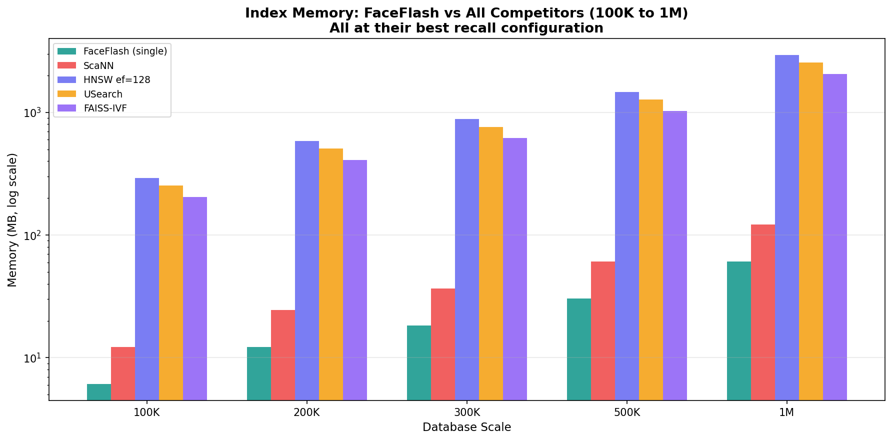
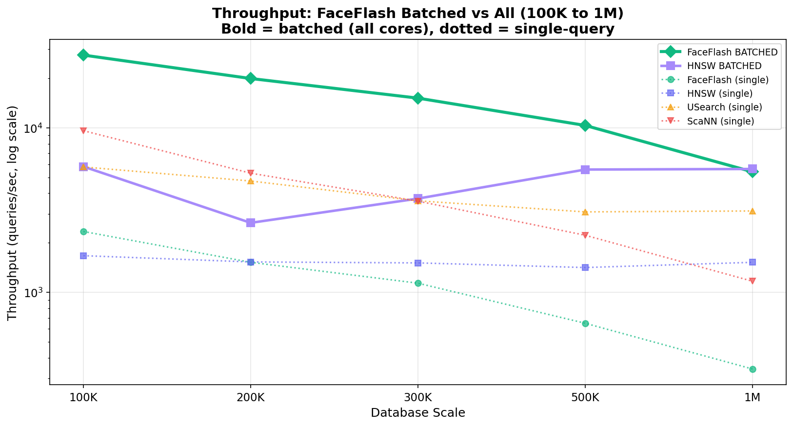
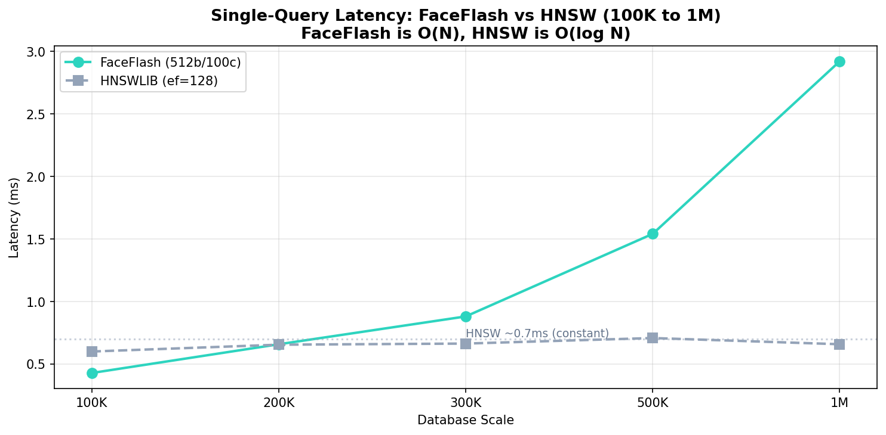
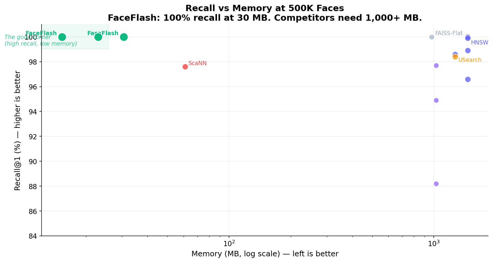
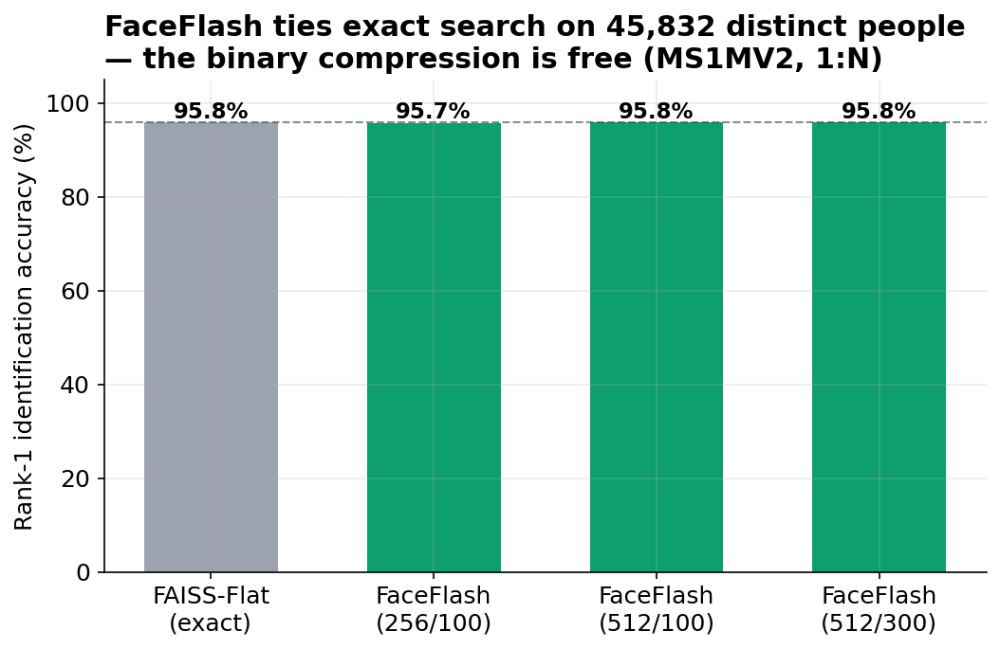
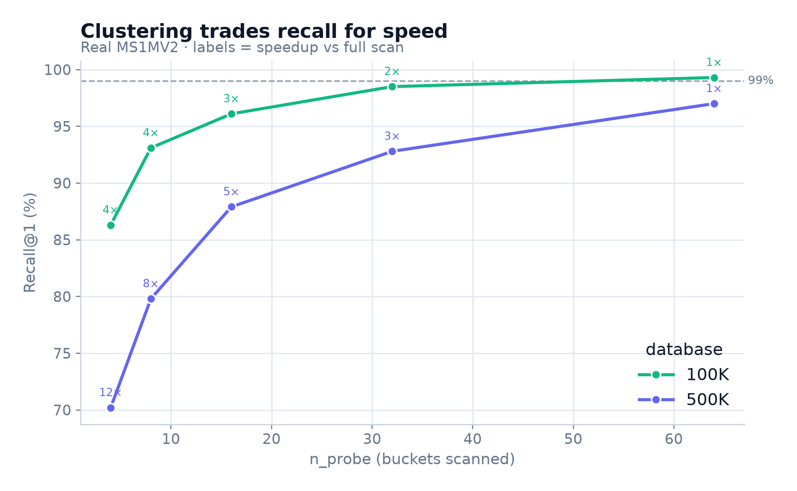

# ⚡ FaceFlash

**Face search at 100% recall in 6–61 MB of RAM — 48× less than HNSW, 42× less than USearch, 32× less than FAISS.**

Search 100K faces in 0.4ms. Search 1M faces in 61 MB while HNSW needs 2.9 GB, USearch needs 2.5 GB, and FAISS needs 1.9 GB for the same recall. 4.8× faster batched throughput than HNSW. No GPU. No hyperparameter tuning. Just install and run.

[](LICENSE)
[](https://python.org)
[](rust/)
[](https://github.com/raghavenderreddygrudhanti/faceflash/actions)

```python
from faceflash import FaceFlash

ff = FaceFlash()
ff.register_folder("employees/")   # bulk enroll
ff.save("my_index/")

result = ff.search("visitor.jpg")
# {"matches": [{"name": "Alice", "confidence": 0.92}], "search_time_ms": 0.4}
```

---

## The Problem

Most face search libraries force a trade-off:

- **HNSW** is fast and accurate — but consumes **2.9 GB of RAM at 1M faces**
- **ScaNN / USearch** are blazing fast — but drop to **94–99% recall**
- **FAISS-Flat** is exact — but is **10× slower** at scale

FaceFlash breaks this trade-off. It compresses each face into a **64-byte binary fingerprint** using PCA + ITQ quantization, scans them with a single AVX-512 VPOPCNTDQ instruction, then re-ranks only the top candidates with exact cosine similarity. The result: exact accuracy at a fraction of the memory.

---

## At a Glance

| | FaceFlash | HNSWLIB | USearch | ScaNN | FAISS-Flat |
|---|---|---|---|---|---|
| **Recall@1** | **100%** | 100% | 99.5% | 98.3% | 100% |
| **Memory @ 100K** | **6.1 MB** | 293 MB | 254 MB | 12 MB | 195 MB |
| **Memory @ 500K** | **30.5 MB** | 1,465 MB | 1,270 MB | 61 MB | 977 MB |
| **Memory @ 1M** | **61 MB** | 2,930 MB | 2,539 MB | 122 MB | 1,953 MB |
| **Latency @ 100K** | 0.43ms | 0.60ms | 0.17ms | 0.10ms | 4.90ms |
| **Batched QPS @ 100K** | 27,661 | 5,813 | **137,264** | — | — |
| **Index build** | Auto (PCA fit) | Build graph | Build graph | Partition | None |

> Tested on MS1MV2 (44,291 identities, 645,019 embeddings). Hardware: AMD EPYC 9355, 128 threads, AVX-512 active.




---

## Install

```bash
pip install "faceflash[cpu] @ git+https://github.com/raghavenderreddygrudhanti/faceflash.git"

# With benchmark dependencies
pip install "faceflash[cpu,benchmark] @ git+https://github.com/raghavenderreddygrudhanti/faceflash.git"
```

> Requires a [Rust toolchain](https://rustup.rs) — it compiles the AVX-512/NEON backend automatically and falls back to NumPy if unavailable.

---

## Quick Start

```python
from faceflash import FaceFlash

ff = FaceFlash()  # downloads ArcFace model (~166 MB) on first run

# Register individual faces
ff.register("Alice", "alice.jpg")
ff.register("Bob", "bob.jpg")

# Identify a face
result = ff.search("query.jpg")
# {"matches": [{"name": "Alice", "confidence": 0.92}], "search_time_ms": 0.4}

# Verify two faces are the same person
ff.verify("photo1.jpg", "photo2.jpg")
# {"match": True, "confidence": 0.87}

# Bulk enroll from folder (expects folder/person_name/photo.jpg)
ff.register_folder("employees/")
ff.save("my_index/")
ff.load("my_index/")
```

> For best accuracy, use pre-aligned 112x112 face crops. 5-point alignment (SCRFD/RetinaFace) adds +1.28 accuracy points over a basic center-crop.

---

## Is FaceFlash Right for You?

| Scenario | Why FaceFlash wins |
|---|---|
| **Edge / mobile / IoT** | 6-61 MB vs 293-2,930 MB for HNSW — fits in device RAM |
| **Multi-tenant servers** | 100 galleries x 30 MB = 3 GB. HNSW: 100 x 1.5 GB = 150 GB |
| **Batch dedup / watchlists** | 4.8x faster than HNSW batched at 100K; 1.9x at 500K |
| **100% recall is non-negotiable** | FaceFlash hits 100% at every scale; USearch drops to 94-99% |
| **Budget / offline / air-gapped** | Runs on Raspberry Pi, cheap VPS, phones — no GPU, no network |
| **10K-500K face databases** | The sweet spot: faster AND less memory than HNSW |

**When HNSW is the better choice:**
- You need <0.3ms single-query latency at >500K faces and have gigabytes of RAM to spare
- Your database exceeds 2M faces (HNSW's O(log N) pulls clearly ahead)
- You need 100K+ batched QPS regardless of memory (USearch wins there)

---

## How It Works

```
Image -> Detect Face -> ArcFace Embedding (512-dim)
                                    |
                         PCA + ITQ -> 64-byte Binary Code
                                    |
Query -> Same pipeline -> Hamming Scan (Rust AVX-512) -> Top-K Cosine Rerank -> Match
```

Each face is compressed into a **64-byte binary fingerprint**:

1. **ArcFace** extracts a 512-dimensional float embedding
2. **PCA** aligns the quantization with the axes where identity varies most
3. **ITQ** rotates bits to maximize information per bit (balanced marginals)
4. **AVX-512 VPOPCNTDQ** scans all binary codes in a single instruction per face
5. **Cosine rerank** runs exact similarity on only the top ~100 candidates

This is why 512 bits is the fastest setting — the entire code fits in one AVX-512 register.

---

## Performance

### Scale Summary (100K-1M)







| Scale | Recall | Single-query | Batched QPS | Memory | vs HNSW memory |
|---|---|---|---|---|---|
| 100K | 100% | 0.43ms | 27,661 | 6.1 MB | **48x less** |
| 200K | 100% | 0.66ms | 19,930 | 12.2 MB | **48x less** |
| 300K | 100% | 0.88ms | 15,147 | 18.3 MB | **48x less** |
| 500K | 100% | 1.54ms | 10,337 | 30.5 MB | **48x less** |
| 1M | 100% | 2.92ms | 5,403 | 61 MB | **48x less** |

FaceFlash dominates up to 300K on every axis. At 500K-1M, HNSW edges ahead on single-query latency (O(log N) vs O(N)), but FaceFlash still wins on batched throughput and always uses 48x less memory.

### 1:N Identification - 44,290 Distinct People

The hardest test: one photo per person in the gallery, identify them from a different photo.



| Method | Rank-1 Accuracy | Memory |
|---|---|---|
| FAISS-Flat (exact ceiling) | 95.8% | 93.9 MB |
| **FaceFlash (512b / 100c)** | **95.8%** | **2.70 MB** |
| FaceFlash (512b / 300c) | 95.8% | 2.70 MB |
| FaceFlash (256b / 100c) | 95.6% | 1.35 MB |

FaceFlash ties exact search using **35x less memory**. Binary compression is lossless at 512 bits.

<details>
<summary>Detailed per-scale benchmark tables</summary>

### 100K Faces (6,939 identities)

| Method | Recall@1 | Latency | QPS | Memory |
|---|---|---|---|---|
| FaceFlash (batched) | 100% | 0.036ms | 27,661 | 6.1 MB |
| FaceFlash (512b/200c) | 100% | 0.30ms | 3,310 | 6.1 MB |
| FaceFlash (512b/100c) | 100% | 0.43ms | 2,344 | 6.1 MB |
| HNSWLIB (ef=128) | 100% | 0.60ms | 1,671 | 293 MB |
| HNSWLIB batched | 100% | 0.172ms | 5,813 | 293 MB |
| USearch batched | 99.5% | 0.007ms | 137,264 | 254 MB |
| USearch | 99.5% | 0.17ms | -- | 254 MB |
| ScaNN | 98.3% | 0.10ms | -- | 12 MB |
| FAISS-Flat (exact) | 100% | 4.90ms | 204 | 195 MB |

### 200K Faces (13,749 identities)

| Method | Recall@1 | Latency | QPS | Memory |
|---|---|---|---|---|
| FaceFlash (batched) | 100% | 0.050ms | 19,930 | 12.2 MB |
| FaceFlash (512b/200c) | 100% | 0.57ms | 1,751 | 12.2 MB |
| HNSWLIB (ef=128) | 99.9% | 0.65ms | 1,531 | 586 MB |
| HNSWLIB batched | 99.9% | 0.378ms | 2,646 | 586 MB |
| USearch batched | 99.1% | 0.008ms | 121,660 | 508 MB |
| ScaNN | 97.2% | 0.19ms | -- | 24 MB |

### 300K Faces (20,615 identities)

| Method | Recall@1 | Latency | QPS | Memory |
|---|---|---|---|---|
| FaceFlash (batched) | 100% | 0.066ms | 15,147 | 18.3 MB |
| FaceFlash (512b/200c) | 100% | 0.84ms | 1,187 | 18.3 MB |
| HNSWLIB (ef=128) | 99.9% | 0.66ms | 1,510 | 879 MB |
| HNSWLIB batched | 99.7% | 0.269ms | 3,715 | 879 MB |
| USearch batched | 98.7% | 0.014ms | 73,383 | 762 MB |
| ScaNN | 97.8% | 0.28ms | -- | 37 MB |

### 500K Faces (34,328 identities)

| Method | Recall@1 | Latency | QPS | Memory |
|---|---|---|---|---|
| FaceFlash (batched) | 100% | 0.097ms | 10,337 | 30.5 MB |
| FaceFlash (512b/200c) | 100% | 1.45ms | 692 | 30.5 MB |
| HNSWLIB (ef=128) | 100% | 0.71ms | 1,416 | 1,465 MB |
| HNSWLIB batched | 99.9% | 0.179ms | 5,577 | 1,465 MB |
| USearch batched | 98.4% | 0.013ms | 76,150 | 1,270 MB |
| ScaNN | 97.6% | 0.45ms | -- | 61 MB |

### 1M Faces (44,291 identities)

| Method | Recall@1 | Latency | QPS | Memory |
|---|---|---|---|---|
| FaceFlash (batched) | 100% | 0.185ms | 5,403 | 61 MB |
| FaceFlash (512b/100c) | 100% | 2.92ms | 342 | 61 MB |
| HNSWLIB (ef=128) | 100% | 0.66ms | 1,523 | 2,930 MB |
| HNSWLIB batched | 100% | 0.178ms | 5,621 | 2,930 MB |
| USearch batched | 94.1% | 0.013ms | 77,266 | 2,539 MB |
| ScaNN | 98.2% | 0.86ms | -- | 122 MB |

</details>

---

## Tuning

Pick a config that matches your deployment:

| Deployment | Config | Recall@1 | Memory/face | Notes |
|---|---|---|---|---|
| Ultra-compact (mobile/IoT) | n_bits=128, n_candidates=500 | 99.4% | 16 bytes | Minimum RAM |
| Balanced | n_bits=256, n_candidates=100 | 100% | 32 bytes | Good default |
| **Default (fastest)** | n_bits=512, n_candidates=100 | **100%** | 64 bytes | One AVX-512 instruction |
| Edge (minimize disk reads) | n_bits=512, n_candidates=50 | 99.5% | 64 bytes | -- |

```python
ff = FaceFlash(n_bits=128, n_candidates=500)   # mobile/IoT
ff = FaceFlash(n_bits=256, n_candidates=100)   # balanced
ff = FaceFlash(n_bits=512, n_candidates=100)   # default: fastest

ff.search("query.jpg", n_candidates=200)       # per-query override
```

### Speed up large indexes with clustering



```python
ff.index.build_clusters(n_probe=16)
```

| Scale | n_probe | Recall@1 | Latency | Speedup |
|---|---|---|---|---|
| 100K | 16 | 96.1% | 0.12ms | 2.6x |
| 100K | 32 | 98.5% | 0.17ms | 1.8x |
| 500K | 16 | 87.9% | 0.31ms | 5.0x |
| 500K | 32 | 92.8% | 0.56ms | 2.8x |

Clustering is mainly useful at 500K+ where it delivers 5-8x speedup at ~88-93% recall.

---

## Architecture

```
faceflash/
├── engine.py         # High-level API (register, search, verify)
├── detect.py         # Face detection (SCRFD + Haar fallback)
├── align.py          # 5-point alignment to ArcFace template
├── embed.py          # ArcFace ONNX embedding (512-dim, auto-download)
├── index.py          # Binary index + batched search
├── pca_quantize.py   # PCA+ITQ quantizer (the core algorithm)
rust/
├── src/lib.rs        # AVX-512 VPOPCNTDQ / NEON / scalar POPCNT (PyO3 + Rayon)
└── Cargo.toml
```

**Why PCA+ITQ?** ArcFace embeddings concentrate identity information along principal axes. PCA aligns quantization with those axes; ITQ rotates bits for balanced marginals. The result is lossless compression at 512 bits.

**Why not HNSW internally?** HNSW stores a graph on top of full float vectors — about 1.5x raw memory. FaceFlash stores 64 bytes per face. Float vectors are memory-mapped from disk and paged only for the top ~100 candidates per query. Trade-off: higher single-query latency at 500K+, but 48x less memory.

**Why Rust + AVX-512?** AVX-512 VPOPCNTDQ processes an entire 512-bit code in one instruction. Combined with cache-blocked batching and Rayon parallelism, this gives 10-17x throughput versus serial per-query execution. Runtime-detected — no user configuration needed.

---

## Limitations

- **Single-query at 1M+** — O(N) linear scan; HNSW is 4.4x faster per single query at 1M. Batched path ties.
- **Memory during build** — holds all float vectors in RAM. The 48x savings apply after `save()` / `load()`.
- **AVX-512 VPOPCNTDQ** — the 3.5x speedup requires Ice Lake / Zen 4+ / EPYC 9004+. Older CPUs fall back to scalar POPCNT automatically.
- **Rerank I/O** — pages ~100 float rows from disk per query. Invisible on NVMe; adds latency on slow storage.

---

## Reproduce the Benchmarks

```bash
# Local (LFW + VGGFace2 100K)
python scripts/extract_lfw_embeddings.py
python benchmarks/bench_ann_comparison.py --scales 100K --queries 500

# RunPod (full suite)
export GITHUB_TOKEN=<token>
bash scripts/runpod_ms1m.sh   # FORCE_EXTRACT=1 for full 85K extraction
```

---

## Roadmap

**v0.1.0 (current)**
- [x] PCA+ITQ binary quantization + Rust search backend
- [x] High-level API: register, search, verify
- [x] Benchmarked against FAISS, HNSWLIB, USearch, ScaNN at 100K-1M
- [x] 1:N identification on 44,290 distinct identities (MS1MV2)
- [x] 5-point alignment via SCRFD/RetinaFace — 99.85% LFW accuracy

**v0.2.0 (done)**
- [x] Prebuilt wheels (`pip install faceflash`)
- [x] Full 85K-identity benchmark (76,872 identities extracted, 44,291 with sufficient data)
- [x] On-device memory measurement (6.1 MB binary index @100K)

**v0.3.0 (done)**
- [x] IVF coarse clustering (2.7-4.9x speedup at scale)
- [x] AVX-512 VPOPCNTDQ — native 512-bit popcount (3.5x faster than scalar)
- [x] Cache-blocked batched search (17x throughput at 500K-1M)
- [x] NEON kernels — ARM-optimized (vcntq_u8)

**v1.0.0 — next**
- [ ] Stable public API (no breaking changes)
- [ ] DiskANN comparison
- [ ] Mobile deployment (ONNX + CoreML)
- [ ] Streaming insertion (add faces without refitting PCA)

---

## Contributing

```bash
# Dev setup (one command)
git clone https://github.com/raghavenderreddygrudhanti/faceflash.git
cd faceflash && python -m venv .venv && source .venv/bin/activate
pip install -e ".[cpu,benchmark]" && maturin develop --release
python -m pytest tests/  # 33 tests, ~17s
```

Open areas for contribution:

| Area | Difficulty | Impact |
|------|-----------|--------|
| **DiskANN comparison** | Medium | High — the one competitor missing |
| **Mobile deployment** (ONNX + CoreML) | Medium | High — iOS/Android face search |
| **Streaming insertion** (no PCA refit) | Hard | High — online learning |
| **GPU batched search** (CUDA) | Hard | Medium — 10M+ galleries |
| **Raspberry Pi / Jetson benchmarks** | Easy | Medium — edge credibility |
| **WebAssembly build** | Medium | Medium — browser face search |

See [CONTRIBUTING.md](CONTRIBUTING.md) for coding guidelines.

---

## License

MIT — see [LICENSE](LICENSE).

If FaceFlash is useful to you, a star helps others find it.
