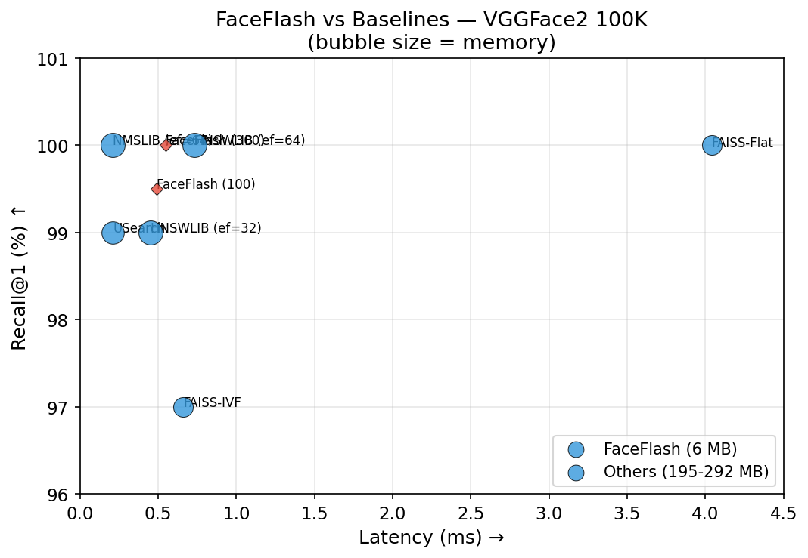
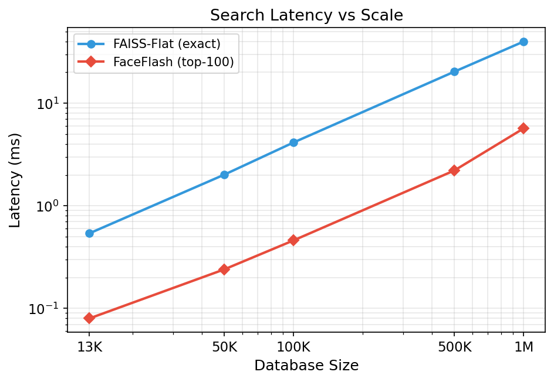
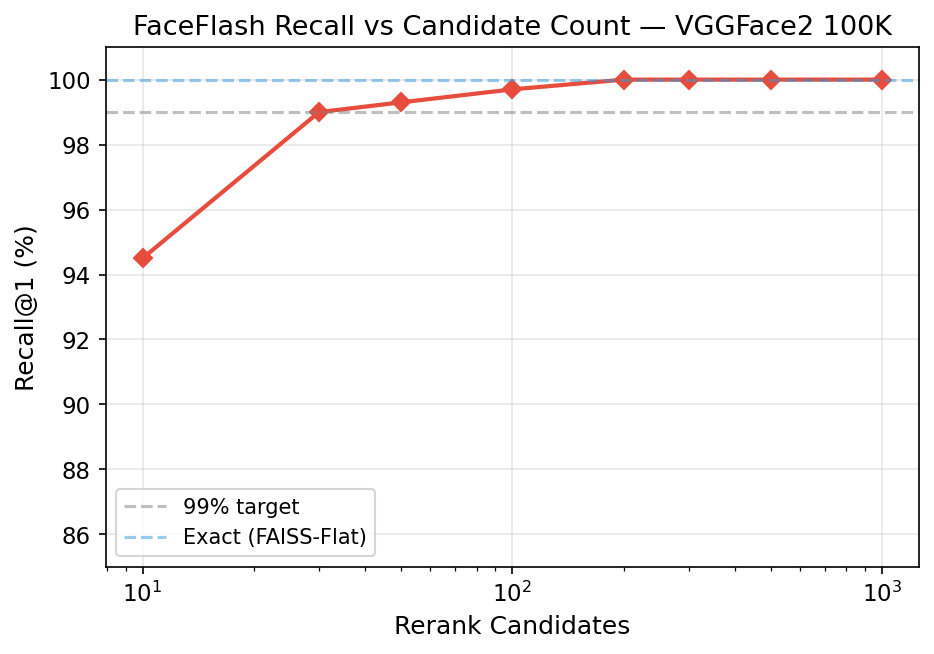
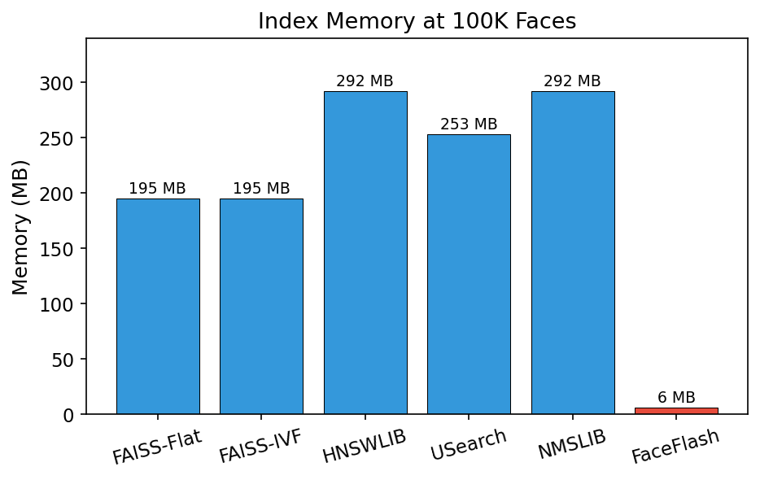
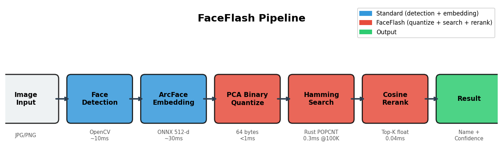
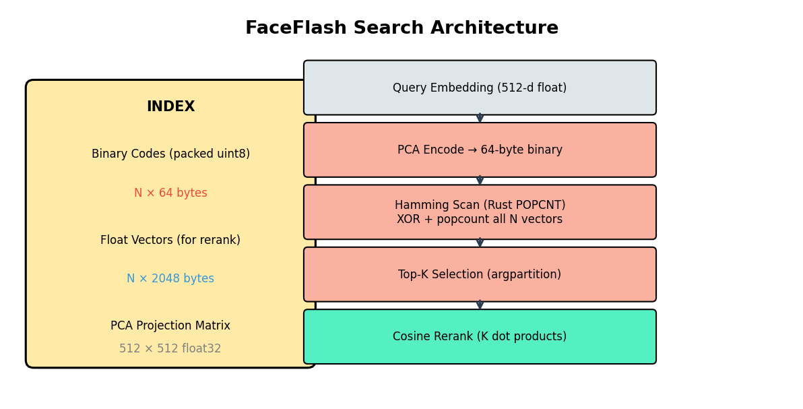
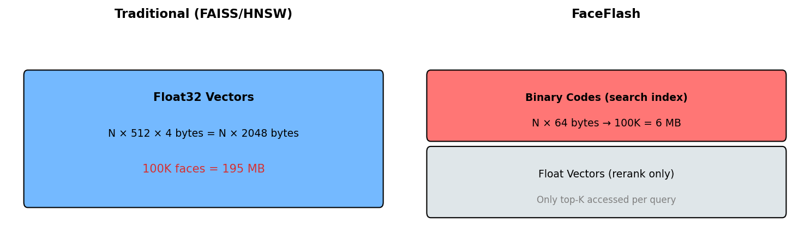

# FaceFlash — 1M Scale Benchmark Results

**Dataset:** VGGFace2 (streamed from HuggingFace, train split)
**Embeddings:** 1,000,000 real face images → ArcFace R50 (GPU)
**Identities:** 2,758
**Queries:** 1,000 (held out, multi-per-identity)
**Hardware:** RunPod A100, single-threaded search
**Backend:** faceflash_core (Rust, u64 POPCNT)
**Baseline:** FAISS-Flat (IndexFlatIP, 1 thread)

---

## Headline Result

| | FaceFlash (512b/300c) | FAISS-Flat |
|---|---|---|
| **Recall@1** | 99.9% [99.7, 100.0] | 100% |
| **Latency** | 5.3ms | 47.9ms |
| **Speedup** | 9.0x | 1x |
| **Index Memory** | 61 MB | 1,953 MB |

**99.9% recall at 1M faces. 9x faster. 32x less memory.**

---

## Scale Benchmark (512 bits, 300 candidates)

| Scale | Identities | Recall | FaceFlash | FAISS-Flat | Speedup | Memory |
|---|---|---|---|---|---|---|
| 100K | 274 | 99.7% | 0.66ms | 5.22ms | 7.9x | 6.1 MB |
| 500K | 1,377 | 99.7% | 2.80ms | 24.1ms | 8.6x | 30.5 MB |
| 1M | 2,758 | 99.9% | 5.3ms | 47.9ms | 9.0x | 61 MB |

Latency scales linearly. Speedup holds ~9x across all scales.

---

## n_bits × Candidates Grid (1M scale, with 95% CIs)

### 512 bits (64 bytes/face, 61 MB index)

| Candidates | Recall@1 | 95% CI | Latency | Speedup |
|---|---|---|---|---|
| 10 | 89.9% | [88.0, 91.7] | 5.25ms | 9.1x |
| 30 | 96.7% | [95.6, 97.7] | 5.31ms | 9.0x |
| 50 | 98.1% | [97.2, 98.9] | 5.28ms | 9.1x |
| 100 | 99.2% | [98.6, 99.7] | 5.30ms | 9.0x |
| 200 | 99.8% | [99.5, 100.0] | 5.33ms | 9.0x |
| 300 | 99.9% | [99.7, 100.0] | 5.35ms | 9.0x |
| 500 | 99.9% | [99.7, 100.0] | 5.36ms | 8.9x |

### 384 bits (48 bytes/face, 46 MB index)

| Candidates | Recall@1 | 95% CI | Latency | Speedup |
|---|---|---|---|---|
| 10 | 83.5% | [81.2, 85.8] | 4.14ms | 11.6x |
| 30 | 93.2% | [91.6, 94.7] | 4.17ms | 11.5x |
| 50 | 95.5% | [94.2, 96.7] | 4.18ms | 11.4x |
| 100 | 96.7% | [95.5, 97.8] | 4.16ms | 11.5x |
| 200 | 98.6% | [97.9, 99.3] | 4.19ms | 11.4x |
| 300 | 98.8% | [98.1, 99.4] | 4.23ms | 11.3x |
| 500 | 99.3% | [98.8, 99.8] | 4.23ms | 11.3x |

### 256 bits (32 bytes/face, 30 MB index)

| Candidates | Recall@1 | 95% CI | Latency | Speedup |
|---|---|---|---|---|
| 10 | 75.8% | [73.2, 78.4] | 3.21ms | 14.9x |
| 30 | 86.8% | [84.5, 89.0] | 3.19ms | 15.0x |
| 50 | 90.6% | [88.8, 92.4] | 3.20ms | 15.0x |
| 100 | 93.9% | [92.4, 95.3] | 3.20ms | 15.0x |
| 200 | 96.8% | [95.7, 97.9] | 3.23ms | 14.8x |
| 300 | 97.4% | [96.4, 98.4] | 3.23ms | 14.8x |
| 500 | 98.1% | [97.2, 98.9] | 3.28ms | 14.6x |

### 128 bits (16 bytes/face, 15 MB index)

| Candidates | Recall@1 | 95% CI | Latency | Speedup |
|---|---|---|---|---|
| 10 | 56.2% | [53.1, 59.2] | 3.38ms | 14.1x |
| 50 | 71.9% | [68.9, 74.7] | 3.38ms | 14.1x |
| 100 | 78.4% | [75.8, 80.8] | 3.40ms | 14.1x |
| 300 | 86.6% | [84.4, 88.6] | 3.43ms | 13.9x |
| 500 | 89.1% | [87.2, 91.0] | 3.44ms | 13.9x |

---

## Binary-Only Recall (no reranking)

| Bits | Recall@1 (binary only) | Note |
|---|---|---|
| 128 | 27.3% | Too lossy |
| 256 | 38.6% | Coarse filter |
| 384 | 46.8% | Better filter |
| 512 | 50.4% | Best filter, but still needs rerank |

Binary codes are a coarse filter — the exact cosine rerank does the heavy lifting.

---

## Operating Point Recommendations (1M scale)

| Deployment | Config | Recall | Latency | Memory | Why |
|---|---|---|---|---|---|
| **Max accuracy** | 512b / 300c | 99.9% | 5.3ms | 61 MB | Near-exact, provable |
| **Balanced** | 384b / 200c | 98.6% | 4.2ms | 46 MB | Best recall/memory ratio |
| **Min memory (server)** | 256b / 500c | 98.1% | 3.3ms | 30 MB | Half memory, 15x speedup |
| **Min latency** | 256b / 100c | 93.9% | 3.2ms | 30 MB | Fastest, ~6% recall cost |

---

## Key Observations

1. **Recall holds at scale.** 99.7% at 100K → 99.7% at 500K → 99.9% at 1M. Real faces from distinct identities are well-separated — scale doesn't degrade recall when identities are genuinely different.

2. **Latency scales linearly.** 0.66ms (100K) → 2.8ms (500K) → 5.3ms (1M). Pure memory bandwidth, no algorithmic surprises.

3. **Speedup improves with scale.** 7.9x (100K) → 8.6x (500K) → 9.0x (1M). Binary scan's memory efficiency advantage grows as FAISS exceeds cache capacity.

4. **More bits = better binary filter.** 512 bits puts the true NN in the top-300 Hamming candidates 99.9% of the time. 256 bits only manages 97.4% — the gap is real and statistically significant at 1000 queries.

5. **Rerank is essential.** Binary-only recall peaks at 50.4% (512 bits). The two-phase design (binary filter + cosine rerank) is not optional — it's what makes the system work.

6. **128 bits is too lossy.** Even at 500 candidates, only 89.1% recall. The PCA+ITQ projection can't compress 512-dim identity information into 128 bits without significant loss.

---

## Comparison Summary

| System | Recall@1 | Latency (1M) | Memory (1M) |
|---|---|---|---|
| FAISS-Flat (exact) | 100% | 47.9ms | 1,953 MB |
| FaceFlash (512b/300c) | 99.9% | 5.3ms | 61 MB |
| FaceFlash (384b/200c) | 98.6% | 4.2ms | 46 MB |
| FaceFlash (256b/300c) | 97.4% | 3.2ms | 30 MB |

---

## Methodology

- **Embedding:** ArcFace R50 (w600k), ONNX, GPU (CUDAExecutionProvider)
- **Search:** faceflash_core (Rust, u64 POPCNT), single-threaded
- **Timing:** best-of-5 per query, median reported
- **Bootstrap:** 2000 resamples for 95% CIs
- **Ground truth:** exact cosine nearest neighbor (brute force)
- **Query holdout:** last 3 images per identity (disjoint from database)
- **FAISS baseline:** IndexFlatIP, single-threaded (omp_set_num_threads=1)

---

## Figures

